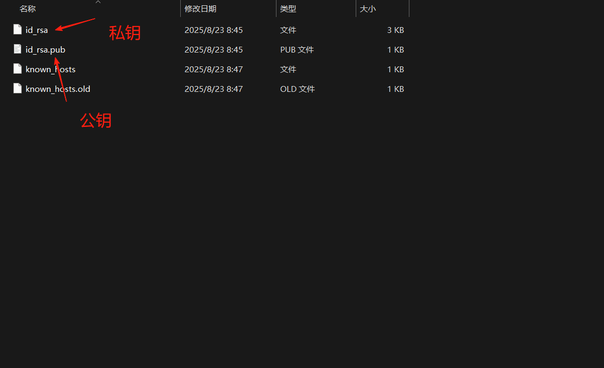

## 绑定github
打开gitbash:

```bash
cd ~/.ssh //进入到.ssh目录(如果没有.ssh目录则创建一个)

ssh-keygen -t rsa -C “git账号”  //生成ssh密钥

ssh -T git@github.com (github绑定之后回来确认)
```


## 设置名字和邮箱
```bash
git config --global user.name "你的名字"
git config --global user.email "你的邮箱"
```